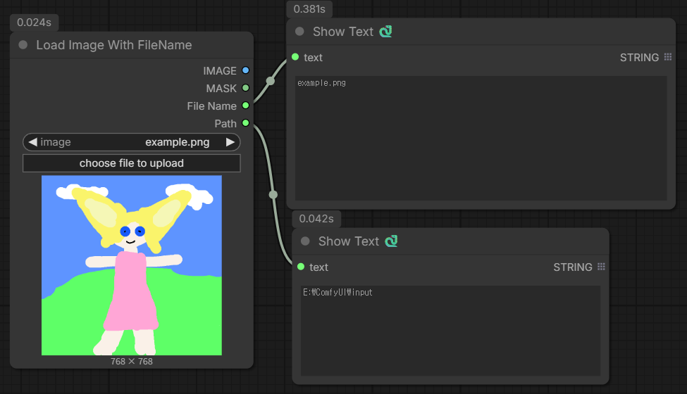

# ComfyUI_LoadImageWithFileName

Load Image With FileName, Path

# Features

- You can load image with file name, path.

# Installation
1. Navigate to your ComfyUI installation directory.
2. Go to the custom_nodes folder.
3. Clone this repository.  
```git clone https://github.com/HAEGONG/ComfyUI_LoadImageWithFileName.git```
4. Restart ComfyUI.
